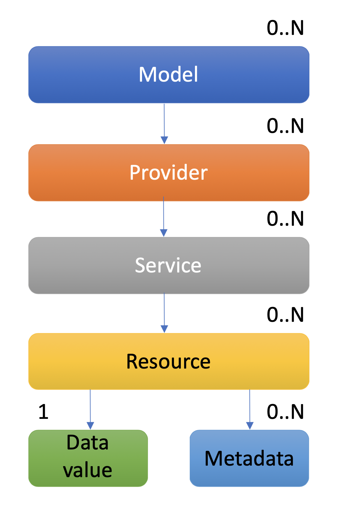

# The sensiNact core model

The sensiNact core model describes the interactions and in-memory representation of the sensiNact "digital twin", i.e. a virtual representation of the state of sensors and actuators connected to the sensiNact gateway.

The sensiNact core data model is broken down into *Resources*, *Services* and *Providers* which are interacted with using the verbs *GET*, *DESCRIBE*, *SET*, *ACT*, *SUBSCRIBE* and *UNSUBSCRIBE*

## Verbs

The sensiNact *verbs* are conceptually similar to the verbs in HTTP. They represent a common set of instructions that can be used to query or change the state of a sensiNact gateway.

### Read only verbs

The following verbs are used to interrogate the state of the gateway without changing it

#### GET

The simplest verb is *GET* which is a request to read a *Resource's* value, or one of its metadata values, from the sensiNact gateway.

#### DESCRIBE

The *DESCRIBE* verb is another read request, but rather than providing access to data or metadata values it provides information about the structure of the described part of the data model. For example a *DESCRIBE* operation on a *Provider* will list the *Services* for that *Provider*, whereas a *DESCRIBE* on a *Resource* will list information about the data and metadata values for the *Resource*.

#### SUBSCRIBE

The *SUBSCRIBE* verb allows the caller to watch for changes in the target part of the data model, for example:

 * Lifecyle events for the creation/deletion of a *Provider*, *Service* or *Resource*
 * Changes in the values of *Resource* metadata
 * Changes in the value of a *Resource*
 * Actions ocurring on a *Resource*

#### UNSUBSCRIBE

The *UNSUBSCRIBE* verb allows the caller to remove a subscription from an earlier *SUBSCRIBE* call

### Edit operations

The following verbs are used to change the state of the gateway, and potentially the devices connected to it

#### SET

The *SET* verb is used to change the value of a *Resource* or to change the metadata associated with a *RESOURCE*

#### ACT

The *ACT* verb is used to trigger an *Action Resource*, potentially passing one or more parameters to a device, and potentially returning a value.

## The core data model

The sensiNact core data model is composed of *Resources*, *Services* and *Providers*, which are arranged in a tree-structure. The definition of the structure for a provider is referred to as the provider model.

{.block-center w=15em}

A `Resource` is the lowest level of the sensiNact data model. A resource represents a single sensor, actuator or state variable within the digital twin. There are two types of *Resources*, data resources and action resources

### Data Resources

A data resource has a single `value` associated with it representing the data it provides.
A resource also has zero or more metadata entries associated with it. For brevity we will use the term `field` to refer to both value and metadata entries.

The `fields` of a resource have associated time stamps representing the times at which they were last updated. They also have an associated property indicating how their value can change.

#### Read-only fields

A read-only field is one cannot be changed by sensiNact. Read-only fields may be `UPDATABLE` and have the potential to change over time (e.g. the data reading from a sensor) or `FIXED` and unchanging (e.g. a hardware identifier reported by a device).

The value of a read-only field can be queried using the `GET` verb, or watched using the `SUBSCRIBE` verb.

#### `MODIFIABLE` fields

A `MODIFIABLE` field is one that can be changed by sensiNact. It may represent a configuration property for a device, or a direct output.

The value of a `MODIFIABLE` field can be queried using the `GET` verb, watched using the `SUBSCRIBE` verb, or changed using the `SET` verb.

### Action resources

Action resources are similar to data resources, but do not have a `value` that can be queried. Action resources represent some actuation capability of a device. Action resources can be triggered using the `ACT` verb. Action resource metadata will include information about the parameters that can be passed when triggering the action.

### Services

A service is a logical grouping of one or more resources that are related, for example a smart plug might have two services:

 1. `switch` - a service representing the switching capability of the smart plug
    * `state` - a resource representing the state of the switch, either `ON` or `OFF`
    * `toggle` - an action resource which changes the state of the switch
 2. `monitor` - a service representing the power monitoring for the smart plug
    * `current` - a resource providing the current passing through the plug
    * `power` - a resource providing the power passing through the plug

### Providers

A `Provider` is a logical representation of a device, group of devices, or physical object, that should be available within sensiNact. Each `Provider` will contain one or more `Service` entries. The description of the services and resources associated with a provider is known as the provider model.

#### The `admin` Service

All `Provider` instances have an implicit service called `admin`. The `admin` service provides information that sensiNact holds about the device. This information may, or may not, correspond to information actually provided by the device.

 * `friendlyName` - a human readable name for this device
 * `location` - a GeoJSON string representing the location of this device
 * `icon` - an icon to use when representing this device

### Looking for more detail?

More detail about the data model can be defined and interacted with is available [here](data-model/DataModel.md)
