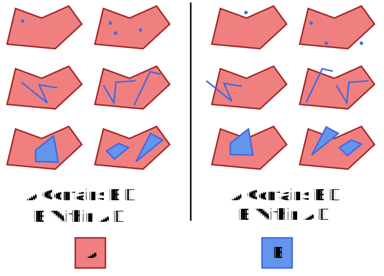
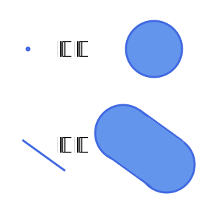
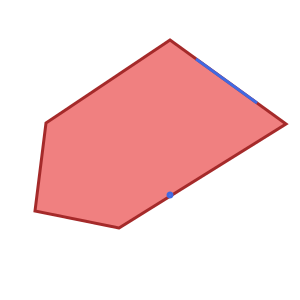

# Eclipse sensiNact Resource Selectors

A resource selector is a simple type of filter designed to easily select a sensinact provider and its resources. It uses simple key/value statements and is easily represented in JSON or other serializations.


```json
/* Resource Selector */
{
  "providers": [
    /* One or more Provider Selection entries */
  ],
  "resources": [
    /* One or more Resource Selection entries
       Note that these entries must not contain any "value" selections
    */
  ]
}

/* Provider Selection */
{
  "modelUri": { /* Selection */ },
  "model": { /* Selection */ },
  "provider": { /* Selection */ },
  "location": { /* Location Selection */ },
  "resources": [
    /* One or more Resource Selection entries */
  ]
}

/* Resource Selection */
{
  "service": { /* Selection */ },
  "resource": { /* Selection */ },
  "value": [
    /* One or more Value Selection entries */
  ]
}

/* Selection */
{
  "value": "some value", /* Always a String */
  "type": "EXACT", /* One of EXACT, REGEX, or REGEX_REGION */
  "negate": false /* whether this is a negative test */
}

/* Value Selection */
{
  "value": "some value", /* Always a String */
  "operation": "EQUALS", /* One of EQUALS, LESS_THAN, GREATER_THAN, LESS_THAN_OR_EQUAL,
                            GREATER_THAN_OR_EQUAL, REGEX, REGEX_REGION, IS_SET, IS_NOT_NULL */
  "negate": false, /* whether this is a negative test */
  "checkType": "VALUE" /* One of VALUE, SIZE or TIMESTAMP */
}
```

## Creating a Filter from a Resource Selector

A filter can easily be created from a Resource Selector using the `ResourceSelectorFilterFactory` service. This service can take a single Resource Selector and turn it into an `ICriterion`, or combine many Resource Selectors into a single `ICriterion` using an `OR` semantic.

The `ResourceSelectorFilterFactory` service also integrates with the sensiNact Filter parser runtime, allowing JSON serialized resource selectors to be handled natively. The filter name used for this parser is `resource.selector`

## Resource Selections

Resource Selections provide the ability to identify a resource that should be returned, and optionally to restrict the set of returned providers based on the value of the resource. The `service` and `resource` properties are used to select the resource(s) that should be included with the selected provider, while the `value` property defines zero or more [Value Selections](#value-selections) that can be used to exclude providers from the set selected by the Resource Selector.

In general it is best to have a one to one mapping between resource selections and selected resources, however this is not required, and if a Resource Selection matches multiple resources in a provider then they will all be selected.

## Provider Selections

The `providers` property of a Resource Selector contains one or more Provider Selections which determine the providers that will be selected. If multiple selections are provided then these are combined using an `OR` semantic. Each provider selection may restrict the `modelUri`, `model`, `provider`, and `location` of the provider, as well as defining zero or more Resource Selections to identify the resources that should be used to further filter the provider list, and then returned for each selected provider.

## Additional Resources

The `resources` property of a Resource Selector contains zero or more Resource Selections which are used to define additional resources that should be included in any selected providers. These do not form part of any filtering, and so must not contain any Value Selections, and are purely additive when selecting data to return for already selected providers.


## Selections

A selection is the simplest part of a resource selector, and applies to the `modelUri`, `model`, `provider`, `service` and `resource` properties. Each of these properties corresponds to a component of the full *name* of the resource, for example the provider name or the service name.

```json
{
  "type": "EXACT",
  "value": "foobar"
}
```

Selections must always have a `value` property, which is the value to be tested against. The type of test is determined by the `type` property, which is one of:

* `EXACT` - the selection value must exactly match the name component
* `REGEX` - the selection value is used as a regular expression which must must match the entire name component
* `REGEX_REGION` - the selection value is used as a regular expression which must match some part of the name component.

If the `type` property is not specified then it has the value `EXACT`.

### Simple selections

If you want to declare a simple `EXACT` match then you can do this by using the value string directly, with no enclosing object.

```json
/* Resource Selection for admin/friendlyName */
{
  "service": "admin",
  "resource": "friendlyName"
}
```

### Wildcard selections

If there should be no restriction on the name component then it should be omitted, or set to `null`. For example the following:

```json
{
  "model": { "value": "foo", "type": "EXACT" },
  "provider": null,
  "service": { "value": "bar", "type": "EXACT" },
  "resource": { "value": "foobar", "type": "EXACT" }
}
```

selects all the `foobar` resource in the `bar` service for *all* providers that use the `foo` model.


### Negation

Selections can be negated using the property `negate` which is a `boolean`. If omitted then the value is `false`. If the value is `true` then the selection rule is negated, meaning that only name components which fail the test are selected.

### Optimising filters

In general it is best to use `EXACT` matches which have `"negate": false` when listening for data updates. This allows sensiNact to minimise the number of events that have to be tested and discarded.

### Multiple Selections

Each selection is a single object, and does not support multiple selections. If you need to select multiple resources then this is best achieved using multiple resource selections.

## Simple Example

The following example shows how a resource selector can be used to gather information from multiple providers. In this example there are two different models:

* `TempSensor` - a temperature sensor which has a `temperature/reading` resource
* `WindSensor` - a wind speed sensor which has `wind/speed` and `wind/direction` resources

The following selector will gather the name, location and readings from all of the sensors which have names starting with `public`.

```json
{
  "providers": [
    {
      "model": "TempSensor",
      "provider": { "value": "public.+", "type": "REGEX" },
      "resources": {
        "service": "temperature",
        "resource": "reading"
      }
    },
    {
      "model": "WindSensor",
      "provider": { "value": "public.+", "type": "REGEX" },
      "resources": [
        {
          "service": "wind",
          "resource": "speed"
        },
        {
          "service": "wind",
          "resource": "direction"
        }
      ]
    }
  ],
  "resources": [
    {
      "service": "admin",
      "resource": "friendlyName"
    },
    {
      "service": "admin",
      "resource": "location"
    },
  ]
}
```


## Value Selections

Value Selections are filters which are applied to the *value* of any and all resources which match the [Selections](#selections) that they are attached to.

Value Selections have the following form:

```json
{
  "value": "17",
  "operation": "GREATER_THAN",
  "negate": false,
  "check": "VALUE",
  "mode": "ANY_MATCH"
}
```

- `value`: the value(s) to test. This can be a single value or a list of values. The test behaviour depends on the [selection mode](#value-selection-mode)
- `operation` (default: `EQUALS`): the [operation](#operation-types) to compare a resource value with a test value
- `negate` (default: `false`): the filter is the negation of the selection
- `check` (default: `VALUE`): which part of the resource must be [checked](#check-type)

Relying on default value, the simple form of the same value selection can be:

```json
{
  "value": "17",
  "operation": "GREATER_THAN"
}
```

Each Resource Selection may define multiple Value Selections. These are combined using an `AND` semantic, therefore all must be satisfied simultaneously. If an `OR` semantic is required then multiple Provider Selections should be used.

### Operation Types

The `operation` of a value selection is one of:

- `EQUALS` (**default**), `LESS_THAN`, `GREATER_THAN`, `LESS_THAN_OR_EQUAL`, `GREATER_THAN_OR_EQUAL`
  - Mathematical operators are applied by converting `value` into the same type as the resource value being tested, and then either using `equals` or by treating the resource value as being [`Comparable`](https://docs.oracle.com/en/java/javase/21/docs/api/java.base/java/lang/Comparable.html).
  - If the resource value is **not `Comparable`** then the operation returns `false`.
- `REGEX` and `REGEX_REGION`
  - Behave as described for [Selections](#selections).
- `IS_SET`
  - A special operator which returns true if the resource has been set to a value.
  - Note that the value may be `null`.
- `IS_NOT_NULL`
  - A special operator which returns true if the resource has been set to a non-null value.

### Check Type

The `check` type of a value selection indicates what should be tested in the resource:

- `VALUE` (**default**): the test will be applied against the resource value.
- `SIZE`: the test will be applied against the size of the resource value. For arrays, collections and maps, this is the number of elements. For strings, this is the length of the string. For numbers, it is the absolute magnitude of the number.
- `TIMESTAMP`: the test will be applied against the timestamp of the resource value. The test value must be an [ISO-8601](https://www.iso8601.com/) datetime string.
- `AGE`: the test will be applied against the age of the resource value, *i.e.* the difference between the resource timestamp and the test execution time. The selection value must be an [ISO-8601 duration](https://www.iso8601.com/#duration) string, *e.g.* `PT4h30M`.
- `AGE_S` or `AGE_MS`: the test will be applied against the age of the resource value, *i.e.* the difference between the resource timestamp and the test execution time. The selection value must be a number of seconds (`AGE_S`) or milliseconds (`AGE_MS`).

### Value Selection Mode

The `mode` of a value selection indicates how the test must be done when multiple test values are given and/or the tested resource value is a list.

The mode can be one of:

- `EXACT_MATCH`: the value of the resource must exactly match the value of the selection, including ordering when multiple values are present
- `ANY_MATCH` (**default**): at least one of the resource value(s) must match any of the given selection value(s). This implies that the resource value must be set.
- `ALL_MATCH`: all of the resource value(s) must have a match in the selection. Order doesn't matter. The selection size may be different from the number of resource values.
- `SUPER_SET`: all of the selection value(s) must be match by the resource value(s), but there may be one or more resource values which do not match.

#### Examples

To demonstrate the value selection mode, we'll consider the following resources:

- `answer` = `42`
- `pool-1` = `[1, 2, 3]`
- `pool-2` = `[2, 10, 42]`

We will consider a value selection with check type `VALUE` and operation `EQUALS`.
Here is the resulting match matrix from different selection values and mode.

| Selection Value | `EXACT_MATCH` | `ANY_MATCH` | `ALL_MATCH` | `SUPER_SET` |
|-----------------|---------------|-------------|-------------|-------------|
| `42`            | `answer`      | `answer`; `pool-2` (`42` matches) | `answer` | `answer`; `pool-2` (selection value match on `42`) |
| `[1, 2, 3]`     | `pool-1`      | `pool-1` (exact match); `pool-2` (`2` matches) | `pool-1` | `pool-1` (pool-2 doesn't match `1` and `3`) |
| `2`             | No match      | `pool-1`; `pool-2` | No match | `pool-1` (selection value match on `2`); `pool-2` (selection value match on `2`) |
| `[3, 42]`       | No match      | `answer` (`42` matches); `pool-1` (`3` matches); `pool-2` (`42` matches) | `answer` (`42` matches) | No match (`answer` and `pool-2` don't match `3`; `pool-1` doesn't match `42`) |


### Simple Value Selections

If you want to declare a simple `EQUALS` match then you can do this by using the value string directly, with no enclosing object.

```json
/* Resource Selection for admin/friendlyName */
{
  "service": "admin",
  "resource": "friendlyName",
  "value": "sample"
}
```

### Value Selections Combination

Value selections may be provided singly, or in an array:

```json
{
  "model": {
    "value": "testModel"
  },
  "resources": {
    "service": {
      "value": "testService"
    },
    "resource": {
      "value": "testResource"
    },
    "value": {
      "value": "17",
      "operation": "EQUALS"
    }
  }
}
```

or

```json
{
  "model": {
    "value": "testModel"
  },
  "resources": {
    "service": {
      "value": "testService"
    },
    "resource": {
      "value": "testResource"
    },
    "value": [
      {
        "value": "5",
        "operation": "GREATER_THAN"
      },
      {
        "value": "17",
        "operation": "LESS_THAN"
      }
    ]
  }
}
```

Where more than one value is supplied the filters are combined using a logical `AND` semantic, meaning that the above Resource Selector selects the resource `testResource` from the service `testService` for all providers using the model `testModel`, restricted to only those resources with values between 5 and 17 (exclusive).

### Negation

Value Selections can be negated using the property `negate` which is a `boolean`. If omitted then the value is `false`. If the value is `true` then the selection rule is negated, meaning that only name components which fail the test are selected.

## Location Selections

Location Selections are used to limit the geographic area within which a Resource Selector operates:

```json
{
  "value": {  /* A GeoJSON Object */ },
  "radius": 100.0,
  "type": "CONTAINS"
}
```

Unlike [Value Selections](#value-selections) the Resource Selector does not need to select the `location` resource from the `admin` service in order to filter its value.

### Operation Types

The `value` property of the Location Selection is a GeoJSON object representing the area to be tested against. As with [value selections](#value-selections) the `value` represents the *right hand side* of the operation.

The `operation` of a value selection is one of:

* `CONTAINS` - The location of the provider is *fully contains* the region defined by this Location Selection. This is commonly used for identifying providers that cover a particular location, e.g. which cameras can view the supplied point.
* `WITHIN` - The location of the provider is *fully contained within* the region defined by this Location Selection. This is commonly used for geo-fencing, e.g. finding all providers inside a given area.
* `INTERSECTS` - The location of the provider is at least partially contained within the region defined by this Location selection. This is commonly used for geo-fencing, e.g. finding all providers that relate to a given area.
* `DISJOINT` - The location of the provider is *totally separate* from the region defined by this Location Selection.

There is no default value for the `operation` property and it must be specified.

#### CONTAINS and WITHIN

The `CONTAINS` and `WITHIN` operators form a logical pair. Specifically that if *A CONTAINS B* is true then by definition *B WITHIN A* is also true. Both `CONTAINS` and `WITHIN` are not commutative.

The following diagrams outline how `CONTAINS` and `WITHIN` work with various GeoJSON types, such as `MultiPoint` and `LineString`



#### INTERSECTS and DISJOINT

The `INTERSECTS` and `DISJOINT` operators form a logical pair, specifically that they are the logical inverse of one another. If *A INTERSECTS B* is true then *A DISJOINT B* must be false and vice versa. Both `INTERSECTS` and `DISJOINT` are commutative.

The following diagrams outline how `INTERSECTS` and `DISJOINT` work with various GeoJSON types, such as `MultiPoint` and `LineString`


### Radius

The `radius` property of a location selection is a number representing the tolerance, in meters, with which the test should be applied. This means that if `value` is a GeoJSON `Point` then the `radius` defines a circle around that point on the earth's surface. If value is a GeoJSON `LineString` then the radius defines a polygon where all points are `radius` away from the line.

For example:



Note that to reduce complexity radius calculations are not made using geodesics, and so are prone to distortion at high latitudes. The further from the equator that you travel the more distorted the radius will become, particularly along an East/West axis. If high accuracy is important to your use case then we recommend performing your own geodesic buffering and then submitting the resulting polygon as the value of your Location Selection.

### Location Selections Combination

Combining Location Selections behave in the same way as [Combining Value Selections](#value-selections-combination) using an `AND` semantic when combining the tests.

### Advanced Location Selection Rules

The following section can be ignored by most users, and is only relevant for those with an interest in Geometry and Geodesy, or those with particularly complex filtering needs.

### Complex Geometries

When either the provider's location or the Location Selection value is a `Feature`, `GeometryCollection` or `FeatureCollection` then it is possible for multiple different GeoJSON object types to apply simultaneously. In this situation the gateway must combine the locations into a single object for filtering. It is not possible for this single object to contain locations of different dimensionality (`Point` has zero dimensions and `Polygon` has two) therefore in this case all of the elements are transformed into two dimensions before being combined.

Essentially this means that the `Point` objects become very small circles and `LineString` objects become very thin polygons (approx 1mm at the equator, less than 1 metre within 5 km of the poles). This is unlikely to have any effect on the results that you see, but if it does then you should attempt to avoid using multi-dimensional geometries for your locations and location selections.

### Differences between Location Selections and Formal Geometry

The Location selections in sensiNact use simplified forms of the formal mathematical operators defining geometric relationships. This is to reduce the complexity of filters and to make them easier to understand.

1. In all cases sensiNact treats the boundary (edge) of a GeoJSON object as being part of the interior of the object.
2. As boundaries are not separate from the interior sensiNact does not require a boundary to be *crossed* for two objects to intersect. They need only share at least one point in their interiors.

These rules mean that in the examples below the `Point` and `LineString` are contained within the `Polygon`, and they intersect with it.



In a formal sense `CONTAINS`, `WITHIN` and `INTERSECTS` should operate slightly differently. This is because in formal geometry the *boundary* of a shape or surface is distinct from the *interior* and *exterior*. Therefore in a formal sense the following examples are *not* contained because they are on the boundary. They also do not intersect because they do not *cross* the boundary.

This formal definition can lead to some surprising results, for example if you collect all the items that intersect, and all the items that are disjoint, then you may still not have all items accounted for. Rather than having this difficult behaviour sensiNact opts for the simpler rules outlined above.

## Compact Resource Selectors

Where only a single resource is required a compact resource selector can be used as a shorthand:

```json
{
  "model": { /* Selection */ },
  "provider": { /* Selection */ },
  "service": { /* Selection */ },
  "resource": { /* Selection */ },
  "value": { /* Value Selection */ },
  "location": { /* Location Selection */ }
}
```
