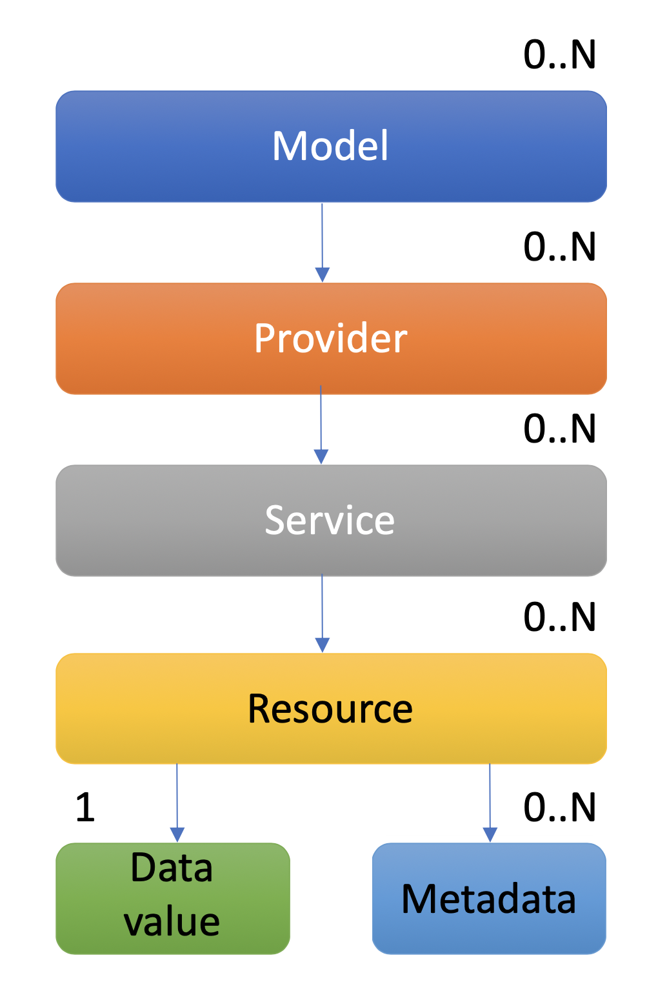

# Welcome to Eclipse sensiNact

{width=120px}

Eclipse sensiNact (lower-case on the first s and capital letter on the second N) is an Open Source framework that aims at creating a common environment in which heterogeneous devices can exchange information and interact among each other in the IoT world.

It is a horizontal platform dedicated to IoT and in particularly used in various smart city and smart home applications.
Eclipse sensiNact aims at managing IoT protocols and devices heterogeneity and provides synchronous (on demand) and asynchronous (periodic or event based) access to data/actions of IoT devices, as well as access to historic data with generic and easy-to-use API.

The project is licensed under the terms of the [Eclipse Public License - v 2.0](EPL-2.0.md).

## Main concepts

Eclipse sensiNact represents its data using the following model:

{.float-right w=25em}

* **Model**: a static or dynamic representation of a kind of provider. This allows to describe the structure of a provider, *i.e.* its services and the type, default value, description, ... of their resources
* **Provider**: a provider of services. It usually represents a physical object, but the granularity depends on the use case. For example, it can be an IoT device with multiple sensors, a car, ...
* **Service**: the name of a set of resources. All providers have the reserved `admin` service which holds sensiNact details about them, including their `location` resource.
* **Resource**: a resource can either represent a property of the provider (like the temperature read from a sensor) or an action (for example to send a text message).

The model is described more in detail in the [Data Model](./core/CoreModel.md) section.

## Getting Started

The following examples will help you to quickly get started with the sensiNact gateway

* [Downloading and Launching](examples/Download.md) - See how to download and start sensiNact
* [Configuring and Querying](examples/Configuring.md) - See how to change sensiNact's configuration and access the REST interface
* [Interacting with a southbound device](examples/Interacting.md) - See how to read a device's data, change editable fields, and listen for updates.
* Building your own Southbound Provider - TODO

## Community

The project is available on [GitHub](https://github.com/eclipse/org.eclipse.sensinact.gateway/).
As it is an Eclipse-hosted project, contributors are required to sign the [Eclipse Contributor Agreement (ECA)](https://www.eclipse.org/legal/ECA.php) for their contributions to be accepted.

You can open issues on [GitHub](https://github.com/eclipse/org.eclipse.sensinact.gateway/issues) to report bugs.
Remember to follow the [code of conduct](https://github.com/eclipse/.github/blob/master/CODE_OF_CONDUCT.md).

You can also ask your questions on the [sensinact-dev mailing list](https://accounts.eclipse.org/mailing-list/sensinact-dev).
