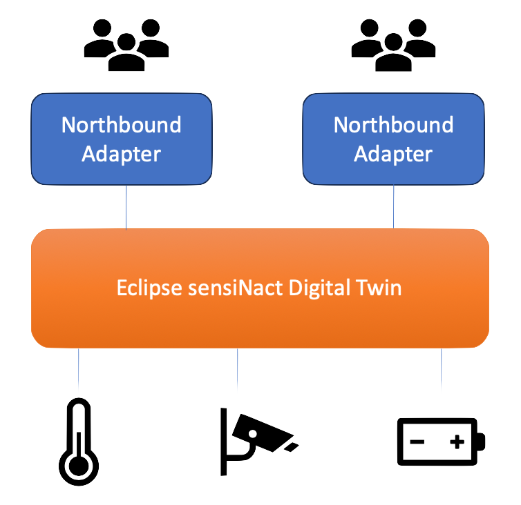

# Northbound providers

{.float-right w=20em}

The *northbound* API of Eclipse sensiNact gateway refers to the parts of the gateway which interface with users and/or machines to provide access to the digital twin. This is typically using a specific protocol over a more generic transport (e.g. REST/HTTP or JSON-RPC/Websocket). It is possible to have multiple northbound providers deployed to a single Eclipse sensiNact gateway instance, allowing access via different interfaces, protocols and transports.

<p class="clear-right"/>

The gateway currently includes the following northbound providers:

* A [REST interface](RestDataAccess.md){.clear-right} using Jakarta RESTful Web Services
* A [Websocket interface](WebsocketDataAccess.md) using Jetty Websockets
* A [REST interface](SensorthingsRestAccess.md) for [OGC Sensorthings 1.1](https://docs.ogc.org/is/18-088/18-088.html#sensorthings-serviceinterface) using Jakarta RESTful Web Services
* An [MQTT interface](SensorthingsMqttAccess.md) for [OGC Sensorthings 1.1](https://docs.ogc.org/is/18-088/18-088.html#receive-mqtt-subscribe) using [Moquette](https://github.com/moquette-io/moquette)


```{toctree}
:hidden:

RestDataAccess
WebsocketDataAccess
SensorthingsRestAccess
SensorthingsMqttAccess
```
