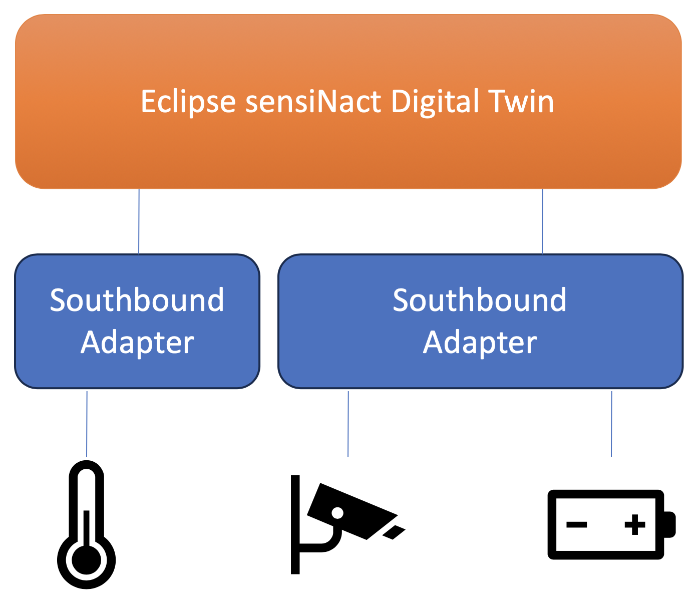

# Southbound providers

{.float-right w=20em}

The *southbound* API of Eclipse sensiNact gateway refers to the parts of the gateway which interface with the external devices. This may be through a generic protocol (e.g. MQTT/HTTP) or through something custom (e.g. a native serial interface). A single southbound provider may create and manage multiple providers in the digital twin, with those providers being of the same type, or of different types.

<p class="clear-right"/>

The gateway currently includes the following southbound providers:

* [Device factory](./device-factory/core.md)
* HTTP
  * [HTTP device factory](./http/http-device-factory.md)
  * [HTTP callback](./http/http-callback.md)
* MQTT
  * [MQTT client](./mqtt/mqtt-client.md)
  * [MQTT device factory](./mqtt/mqtt-device-factory.md)

The history of resource values is considered to be southbound provider linked to a time-series database:

* [sensiNact History](./history/history.md)
  * [Timescale history provider](./history/timescale.md)

Writing your own [custom southbound connector](./custom/custom.md) is very easy, and can allow you to optimise your updates.

```{toctree}
:hidden:
:glob:

device-factory/_index
http/_index
mqtt/_index
history/_index
custom/*
```
