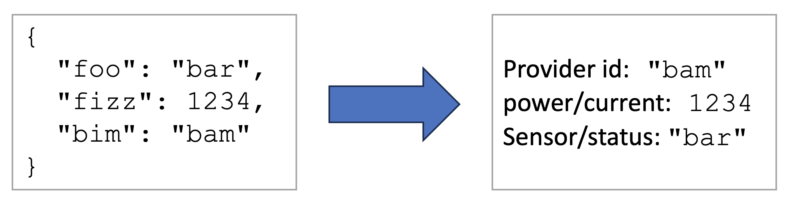

# Device factory core

The device factory handles raw update notifications from transport handlers.
The payload is parsed and its content is mapped to the Eclipse sensiNact model according to a configuration.

{.block-center}

The device factory core is not intended to be used directly, but through a transport-specific device factory.

## Bundles

The device factory bundle is: `org.eclipse.sensinact.gateway.southbound.device-factory:device-factory-core:0.0.2`.

The device factory core itself only requires the sensiNact core bundles (API and GeoJSON).
However, the parsers must be provided by their own implementation bundle.

## Parsers

Eclipse sensiNact includes the following parsers:
* [CSV](./csv.md)
* [JSON](./json.md)

A parser can be created following the [Device Factory Parser Tutorial](./tuto-parser.md).

## Device Factory Configuration

The configuration of the device factory is split into 4 parts:
* `parser`: the ID of the device factory parser to use to parse the payload.
* `parser.options`: parser-specific options to parse the payload. Refer to the parser documentation for more details.
* `mapping`: the resource mapping configuration, to associate a sensiNact resource to a value from the parser.
* `mapping.options`: options for the resource mapper, *e.g.* the date format in use, ...

Here is an example of a device factory configuration:
```json
{
  "parser": "csv",
  "parser.options": {
      "header": true
  },
  "mapping": {
      "@provider": "Name",
      "@latitude": "Latitude",
      "@longitude": "Longitude",
      "@date": "Date",
      "@time": "Time",
      "data/value": "Value"
  },
  "mapping.options": {
    "format.date": "d.M.y",
    "format.time": "H:m"
  }
}
```

## Mapping configuration

The mapping configuration links a sensiNact resource to a parser entry, to a literal or to a variable.

*Note that depending on the parser implementation, the available entries might not match exactly the payload content.*

### Mapping key

The key of the mapping entry can be in the following formats:
* `@xxx`: a placeholder used by the device factory to describe the update and to find the provider to update. Here are the placeholders sensiNact defines:
  * Provider description
    * `@model`: the name of the model of the provider to update
    * `@provider`: the name of the provider to update. **This placeholder is mandatory**.
    * `@name`: the friendly name of the provider (`admin/friendlyName`)
  * Location
    * `@location`: the location of the provider (`admin/location`). The content is expected to be either a GeoJSON object or a short location string (`latitude:longitude[:altitude]`). This placeholder overrides `@latitude`, `@longitude` and `@altitude` if they are defined.
    * `@latitude`: the latitude of the provider, to construct its location. This placeholder **must** be combined with `@longitude`.
    * `@longitude`: the longitude of the provider, to construct its location. This placeholder **must** be combined with `@latitude`.
    * `@altitude`: the altitude of the provider, to construct its location. This placeholder **must** be combined with `@latitude` and `@longitude`.
  * Update timestamp
    * `@timestamp`: the timestamp of the update either in millisecond or second precision (auto-detected). Overrides `datetime`, `@date` and `@time` if they are defined.
    * `@datetime`: the date and time of the update. Overrides `@date` and `@time` if they are defined. The datetime format can be defined in the mapping options.
    * `@date`: the date of the update, should be used with `@time`. The date format can be defined in the mapping options.
    * `@time`: the time of the update, should be used with `@date`. The time format can be defined in the mapping options.
* `$xxx`: definition of a variable that can be reused in or as a mapping value. The variable can be used in other mapping key or in record paths using the `${xxx}` syntax.
* `"svc/rc"`: the parser value will be stored in a the resource `rc` of the service `svc`

### Mapping value

The value of a mapping can be defined in many different formats.

In the examples of this section, we consider the input payload being a CSV file with the following content:

```csv
sensor,serial,nbVehicles,nbPersons
A1,ABC12,6,2
B1,ABC13,0,10
```

#### Record path

A mapping defined by a record path will get the value from the parser "as is".
This means the resource value will contain it in its parsed type.
For example, all the values from the CSV parser are strings, whereas the JSON parser will detect strings, numbers, booleans, arrays, ...

Here is an example of mapping the provider name to the record path `sensor` and the value of the resource `serial` in the service `sensor` from the record path `serial`:
```json
{
    "@provider": "sensor",
    "sensor/serial": "serial"
}
```

With the example payload, the mapping above defines two providers, `A1` and `B1`, each with a service `sensor` providing a resource `serial` with values being respectively `ABC12` and `ABC13`.

Both mapping keys and record paths can be constructed from variables.
For example, considering the following payload:
```csv
sensor,type,temperature,humidity
A,temperature,21,-1
B,humidity,-1,64
```

And the following mapping:
```json
{
    "$id": "sensor",
    "$kind": "type",
    "@provider": "${id}",
    "sensor/${kind}": "value"
}
```

We would obtain two providers:
* Provider `A` with a resource `temperature` in service `sensor`, with the value 21
* Provider `B` with a resource `humidity` in service `sensor`, with the value 64

Finally, note that the record path depends on the parser.
In the case of CSV payloads without headers, it is a column index number given as an integer (or the string representation of an integer). For example `"sensor/serial": 2`. Note that the first column index number is 0.
In the case of the JSON parser, it can be a path through objects or indices through arrays: `"sensor/serial": "sensor/array/0/serial`

For example, the path `sensor/array/0/serial` would allow to access the value `ABC123` in the following JSON payload:
```json
{
    "sensor": {
        "properties": {
            "kind": "multi-sensor"
        },
        "array": [
            {
                "serial": "ABC123",
                "type": "temperature",
                "year": 2021
            },
            {
                "serial": "ABC124",
                "type": "humidity",
                "year": 2022
            }
        ]
    }
}
```


#### Configured record path

##### Value type

Some parsers, like the CSV one, can't determine the type of the value they are parsing.
The mapping configuration allows to indicate the type the parsed value must be converted to.

For example, if we consider the payload:
```csv
sensor,serial,nbVehicles,nbPersons
ABC,12345,6,2
```

And the following mapping:
```json
{
    "@provider": "sensor",
    "sensor/serial": "serial",
    "sensor/vehicles": {
        "path": "nbVehicles",
        "type": "int"
    },
    "sensor/pedestrians": {
        "path": "nbPersons",
        "type": "float"
    }
}
```

We would a provider `ABC` with the following mapped resources in the `sensor` service:
* `serial`: `"12345"` as a string, as the CSV parser returns values as string by default
* `vehicles`: `6` as an integer
* `pedestrians`: 2.0 as float

The available types are:
* `any`: use the value as it was parsed (default)
* `string`: convert the value to a string
* `int`, `long`: convert the value to an integer
* `float`, `double`: convert the value to floating point number
* `string[]`: convert the value to an array of strings
* `int[]`, `long[]`: convert to an array of integers
* `float[]`, `double[]`: convert to an array of floating point numbers

##### Default value

The record path configuration can define a default value.
The default value will be treated as if it was read by the parser and will therefore be converted to the value type, if defined.

```json
{
    "vehicle/count" {
        "path": "nbVehicles",
        "type": "int",
        "default": 0
    }
}
```

#### Literal value

It is also possible to construct literal values from the record paths and variables.

Here is an example to fix the `city` resource to `Grenoble`:
```json
{
    "sensor/city": {
      "literal": "Grenoble"
    }
}
```

Literals also support interpolation using the `${var}` format.


Here is an example of a complex use of variables, considering the following payload:
```csv
name,city
Thomas,Grenoble
```

And the following configuration:
```json
{
    "$name": {
        "path": "name",
        "default": "World",
        "type": "string"
    },
    "$words": {
        "literal": "HelloBye!"
    },
    "@name": "${name}",
    "greet/hello": "${words[:5]} ${name}!",
    "greet/bye": "${words[5:-1]} ${name}!"
}
```

We will have the provider friendly name set to "Thomas" and the "greet" service will have two resources:
* "hello": "Hello Thomas!"
* "bye": "Bye Thomas!"

## Mapping options

The device factory mapper itself can be fine-tuned with the `mapping.options` entry.
The following entries are supported:

* Date inputs format: the given pattern must be valid for [java.time.format.DateTimeFormatter](https://docs.oracle.com/en/java/javase/11/docs/api/java.base/java/time/format/DateTimeFormatter.html). The default format is the ISO-8601.
  * `format.datetime`: the format of the value read by `@datetime`.
  * `format.date`: the format of the value read by `@date`
  * `format.time`: the format of the value read by `@time`
* Complement to date input
  * `datetime.timezone`: Name of the timezone of the date and time inputs.
  It must be valid for the [java.time.ZoneId.of()](https://docs.oracle.com/en/java/javase/11/docs/api/java.base/java/time/ZoneId.html#of(java.lang.String)), for example: `Europe/Paris` or `+0200`.
  Dates without timezone are considered to be in UTC.
* Number inputs:
  * `numbers.locale`: the name of the locale to use to parse numbers, *e.g.* `fr`, `en_us`, `zh_Hand_TW`.
